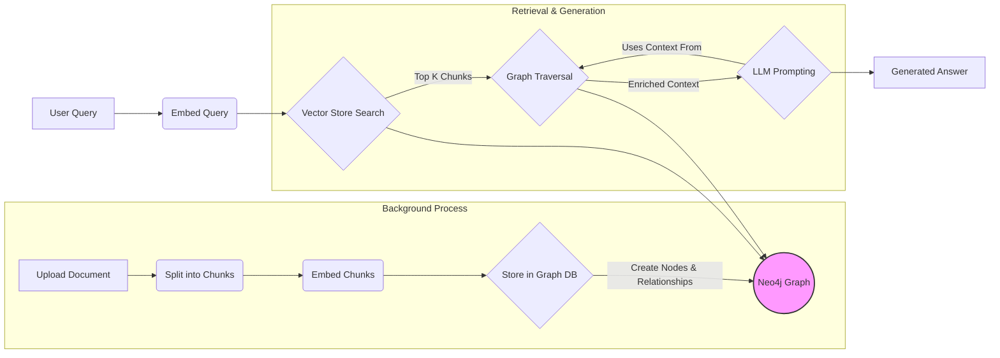
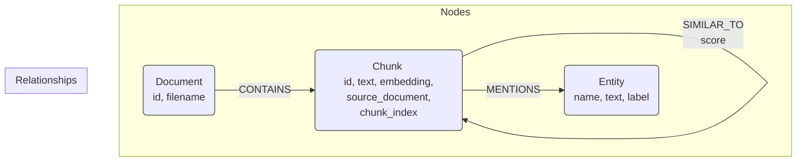

# Graph RAG Project: [Your Project Name Here]

## Table of Contents

- [Graph RAG Project: \[Your Project Name Here\]](#graph-rag-project-your-project-name-here)
  - [Table of Contents](#table-of-contents)
  - [Overview](#overview)
  - [Core Concepts: What is Graph RAG?](#core-concepts-what-is-graph-rag)
  - [Project Architecture](#project-architecture)
    - [High-Level Workflow Diagram](#high-level-workflow-diagram)
  - [Core Components](#core-components)
    - [Configuration (`config.py`)](#configuration-configpy)
    - [Document Processing (`document_processing.py`)](#document-processing-document_processingpy)
    - [Embeddings (`embedder.py`)](#embeddings-embedderpy)
    - [Language Model Client (`model_client.py`)](#language-model-client-model_clientpy)
    - [Graph Database Interaction (`graph_db.py`)](#graph-database-interaction-graph_dbpy)
    - [Ingestion Pipeline (`main.py::ingest_pipeline`)](#ingestion-pipeline-mainpyingest_pipeline)
    - [Retrieval Strategy (`retriever.py`)](#retrieval-strategy-retrieverpy)
    - [API Server (`main.py`)](#api-server-mainpy)
    - [Logging](#logging)
  - [Data Model: Graph Structure](#data-model-graph-structure)
    - [Nodes](#nodes)
    - [Relationships](#relationships)
    - [Graph Schema Diagram](#graph-schema-diagram)
  - [**Key Modifiable Components for Reuse**](#key-modifiable-components-for-reuse)
    - [**Ingestion Pipeline Details** (`main.py::ingest_pipeline`)](#ingestion-pipeline-details-mainpyingest_pipeline)
      - [Ingestion Flow Diagram](#ingestion-flow-diagram)
    - [**Retrieval Strategy Details** (`retriever.py`)](#retrieval-strategy-details-retrieverpy)
      - [Retrieval Flow Diagram](#retrieval-flow-diagram)
  - [Setup and Installation](#setup-and-installation)
  - [Usage](#usage)
    - [Running the Server](#running-the-server)
    - [Uploading Documents](#uploading-documents)
    - [Chatting with the RAG](#chatting-with-the-rag)
  - [Configuration Reference](#configuration-reference)
  - [Future Improvements / Considerations](#future-improvements--considerations)

---

## Overview

This project implements a Retrieval-Augmented Generation (RAG) system that leverages a Knowledge Graph to enhance context retrieval. Instead of just relying on semantic similarity search over text chunks, it utilizes the relationships stored within a graph database (Neo4j) to find more relevant and interconnected information before feeding it to a Large Language Model (LLM) for generating answers.

This README provides a comprehensive breakdown of the project's components, data structures, and workflows, aiming to serve as documentation for future reference and potential reuse in other Graph RAG projects.

## Core Concepts: What is Graph RAG?

Standard RAG involves:
1.  Indexing document chunks into a vector store.
2.  Retrieving relevant chunks based on semantic similarity to a user query.
3.  Providing these chunks as context to an LLM to answer the query.

**Graph RAG** extends this by:
1.  Representing documents, chunks, and extracted entities/concepts as nodes in a graph.
2.  Creating relationships between these nodes (e.g., sequential order, semantic similarity, entity mentions).
3.  Using both vector similarity search *and* graph traversal during retrieval to gather a richer, more interconnected context for the LLM.

This approach can uncover relationships and context missed by simple vector search alone.

## Project Architecture

The system is built using Python, FastAPI, LangChain, Neo4j, Azure AI Embeddings, Hugging Face Transformers (for NER), and a custom Qwen LLM client.

1.  **Ingestion:** Documents (PDF, TXT) are uploaded, split into chunks, embedded, and stored in Neo4j. Relationships (sequential, similarity, entity mentions) are created between nodes.
2.  **Retrieval:** A user query is embedded. An initial set of relevant chunks is retrieved via vector search. The graph is then traversed from these initial chunks to find related information (neighboring chunks, similar chunks).
3.  **Generation:** The combined retrieved context is formatted and passed to the LLM along with the original query to generate a final answer.

### High-Level Workflow Diagram



## Core Components

### Configuration (`config.py`)

*   **Purpose:** Centralizes all configuration parameters loaded from environment variables (`.env`) and sets default values.
*   **Key Settings:** Logging level/path, File Upload Directory, Embedding Service details (Azure Endpoint/Key, Model Name, Dimension), LLM details (Qwen API URL/Key, Model Name, Generation Parameters), Neo4j Credentials, RAG parameters (Chunk Size/Overlap, Search K, Graph Neighbors), Ingestion parameters (Similarity Threshold, Link Count), NER Model.

### Document Processing (`document_processing.py`)

*   **Purpose:** Loads documents from specified file paths and splits them into manageable chunks.
*   **Libraries:** LangChain (`PyPDFLoader`, `TextLoader`, `RecursiveCharacterTextSplitter`).
*   **Functionality:**
    *   Supports PDF and TXT files.
    *   Uses `RecursiveCharacterTextSplitter` based on `CHUNK_SIZE` and `CHUNK_OVERLAP`.
    *   Adds metadata to each chunk: unique `id` (hash-based), `chunk_index`, `source_document`, `source`, `page`.


### Embeddings (`embedder.py`)

*   **Purpose:** Provides an interface to generate text embeddings using Azure AI Inference.
*   **Service Used:** Azure AI Embeddings (`text-embedding-3-large` by default, dimension `3072`).
*   **Implementation:** Wraps the `azure.ai.inference.EmbeddingsClient` within a LangChain `Embeddings` compatible class (`AzureEmbeddings`). Includes retry logic and timeout handling.
*   **Reusability:** Medium. Specific to Azure AI Embeddings. Easily replaceable with other embedding providers (OpenAI, Hugging Face local models, etc.) by creating a similar LangChain-compatible class. The choice of embedding model and dimension (`EMBEDDING_DIMENSION`) is crucial and project-dependent.

### Language Model Client (`model_client.py`)

*   **Purpose:** Provides an interface to interact with the specified Large Language Model.
*   **Service Used:** Custom Qwen API endpoint (`api.totalgpt.ai`).
*   **Implementation:** Creates a custom LangChain `SimpleChatModel` (`CustomChatQwen`) that handles API calls, authentication, payload formatting (including model parameters like temperature, top_k, repetition_penalty), retries, and timeouts.
*   **Reusability:** Medium. Specific to the Qwen API structure. Easily replaceable with other LLM providers (e.g., `ChatOpenAI`, `ChatHuggingFace`) by using their respective LangChain integrations or creating a similar custom client if needed.

### Graph Database Interaction (`graph_db.py`)

*   **Purpose:** Manages connection and interaction with the Neo4j graph database.
*   **Libraries:** `langchain_neo4j.Neo4jGraph`, `langchain_community.vectorstores.Neo4jVector`.
*   **Functionality:**
    *   Provides functions to get `Neo4jGraph` (for general Cypher queries) and `Neo4jVector` (for vector search integration) instances.
    *   Ensures necessary constraints (`Chunk.id`, `Document.id`) and vector index (`chunk_embeddings`) exist in Neo4j upon initialization. The vector index uses `cosine` similarity and the configured `EMBEDDING_DIMENSION`.
    *   Defines the structure for nodes (`Chunk`) and properties (`text`, `embedding`) used by the vector store.
*   **Reusability:** High. Specific Neo4j connection details will change, but the pattern of using `Neo4jGraph` and `Neo4jVector` is standard for LangChain + Neo4j integrations. The index name and node labels might change based on the data model.

### Ingestion Pipeline (`main.py::ingest_pipeline`)

*   **Purpose:** Orchestrates the entire process of adding a document to the knowledge graph. Runs as a background task.
*   **Key Steps:**
    1.  Load and split the document (`document_processing.load_and_split_document`).
    2.  Add chunk documents (text + embeddings) to the `Neo4jVector` store.
    3.  Create a `Document` node representing the source file.
    4.  Link the `Document` node to its `Chunk` nodes via `[:CONTAINS]` relationships.
    5.  Link sequential `Chunk` nodes via `[:NEXT_CHUNK]` relationships.
    6.  **Extract Entities:** Use Hugging Face `transformers` NER pipeline (`dslim/bert-base-NER`) to identify Persons (`PER`), Organizations (`ORG`), and Locations (`LOC`) within each chunk.
    7.  Create `Entity` nodes (using lowercase name as the unique key) and link `Chunk` nodes to the entities they mention via `[:MENTIONS]` relationships.
    8.  **Create Similarity Links:** Perform a vector similarity search *within* the graph (`db.index.vector.queryNodes`) for each newly added chunk to find existing similar chunks above a threshold (`INGEST_SIMILARITY_THRESHOLD`). Create `[:SIMILAR_TO]` relationships between sufficiently similar chunks (optionally restricted by `INGEST_ENABLE_INTRA_DOC_SIMILARITY`).
*   **Reusability:** **Medium to High**. This is a core, often customized part. The steps (splitting, embedding, storing) are common, but the *types* of relationships created (`NEXT_CHUNK`, `MENTIONS`, `SIMILAR_TO`) and the methods for creating them (NER model, similarity threshold) are project-specific choices. **This is a key area to review for reuse.**

### Retrieval Strategy (`retriever.py`)

*   **Purpose:** Defines how context is retrieved from the vector store and graph to answer a query.
*   **Implementation:** Uses LangChain Expression Language (LCEL) to chain operations.
    1.  **Initial Retrieval:** Uses the `Neo4jVector` store (`vector_retriever`) to find the top `TOP_K_INITIAL_SEARCH` chunks based on vector similarity to the query.
    2.  **Graph Enhancement (`fetch_neighbors`):** Takes the initial chunks and queries the Neo4j graph (`graph.query`) to find neighboring nodes up to `GRAPH_CONTEXT_NEIGHBORS` hops away via:
        *   `[:NEXT_CHUNK]` relationships (previous and next sequential chunks).
        *   `[:SIMILAR_TO]` relationships (semantically similar chunks).
    3.  **Combine & Format:** Merges the initial and neighbor chunks (deduplicating) and formats them into a single string (`format_docs`) for the LLM context.
*   **Reusability:** **Medium to High**. The two-stage approach (vector search + graph traversal) is common in Graph RAG. However, the specific graph query used in `fetch_neighbors` (which relationships to traverse, how many hops, any filtering logic) is highly customizable and depends heavily on the graph schema and the desired retrieval behavior. **This is another key area to review for reuse.**

### API Server (`main.py`)

*   **Purpose:** Exposes the RAG functionality via a REST API using FastAPI.
*   **Endpoints:**
    *   `/upload-context` (POST): Accepts file uploads, saves the file, and triggers the `ingest_pipeline` background task.
    *   `/chat` (POST): Accepts a user message, orchestrates the retrieval (using the graph-enhanced retriever) and generation (using the `CustomChatQwen` client) process via an LCEL chain, and returns the LLM's reply.
*   **Reusability:** High. Standard FastAPI setup. The specific RAG chain logic within `/chat` depends on the chosen retriever and LLM components.

### Logging

*   **Purpose:** Provides consistent logging throughout the application.
*   **Setup (`config.py::setup_logging`):** Configures logging to both the console and a rotating file (`logs/rag_backend.log`). Log level is configurable via `LOG_LEVEL` env var.
*   **Usage:** Other modules get a logger instance via `config.get_logger(__name__)`.
*   **Reusability:** High. Standard Python logging setup.

---

## Data Model: Graph Structure

The knowledge graph is stored in Neo4j and consists of the following elements:

### Nodes

1.  **`Chunk`**: Represents a segment of text derived from a source document.
    *   `id` (String, Unique): Unique identifier for the chunk (hash-based).
    *   `text` (String): The actual text content of the chunk.
    *   `embedding` (List[Float]): The vector embedding of the `text` (dimension: `3072`).
    *   `source_document` (String): The filename of the original document.
    *   `chunk_index` (Integer): The sequential index of the chunk within its document.
    *   *(Other metadata like `source`, `page` may be present)*
2.  **`Document`**: Represents the original source document file.
    *   `id` (String, Unique): Unique identifier for the document (e.g., `doc_filename_ext`).
    *   `filename` (String): The original name of the uploaded file.
    *   `last_updated` (DateTime): Timestamp of the last update/ingestion.
3.  **`Entity`**: Represents a named entity (Person, Organization, Location) extracted from the text.
    *   `name` (String, Unique): The *lowercase* text of the entity, used as the primary key for merging.
    *   `text` (String): The original cased text of the entity as extracted.
    *   `label` (String): The type of entity (e.g., "PER", "ORG", "LOC").
    *   `created` (DateTime): Timestamp when the entity was first seen.
    *   `last_seen` (DateTime): Timestamp when the entity was last mentioned.

### Relationships

1.  **`[:CONTAINS]`**: Connects a `Document` node to the `Chunk` nodes derived from it.
    *   `(d:Document)-[:CONTAINS]->(c:Chunk)`
2.  **`[:NEXT_CHUNK]`**: Connects sequential `Chunk` nodes within the same document.
    *   `(c1:Chunk)-[:NEXT_CHUNK]->(c2:Chunk)`
3.  **`[:MENTIONS]`**: Connects a `Chunk` node to an `Entity` node that is mentioned within its text.
    *   `(c:Chunk)-[:MENTIONS]->(e:Entity)`
4.  **`[:SIMILAR_TO]`**: Connects two `Chunk` nodes that are semantically similar based on their vector embeddings.
    *   `(c1:Chunk)-[:SIMILAR_TO {score: Float}]->(c2:Chunk)` (often treated as undirected during retrieval). The `score` property stores the cosine similarity.

### Graph Schema Diagram



---

## **Key Modifiable Components for Reuse**

When adapting this project for different use cases, the **Ingestion Pipeline** and the **Retrieval Strategy** are the most critical areas to review and potentially modify.

### **Ingestion Pipeline Details** (`main.py::ingest_pipeline`)

This pipeline defines *how* knowledge is extracted from documents and structured in the graph.

*   **What might change:**
    *   **Document Types:** Modifying `document_processing.py` to handle different file formats (Word, HTML, JSON, database records).
    *   **Chunking Strategy:** Adjusting `CHUNK_SIZE`, `CHUNK_OVERLAP`, or using different splitting methods (e.g., semantic chunking) in `document_processing.py`.
    *   **Entity Extraction:**
        *   Using a different NER model (e.g., spaCy, a larger/domain-specific transformer) or different entity types (`ENTITY_LABELS_TO_EXTRACT`).
        *   Adding relationship extraction (e.g., identifying that "Person A" *works for* "Organization B"). This would require adding new relationship types to the schema and graph update queries.
    *   **Relationship Creation:**
        *   Changing the `INGEST_SIMILARITY_THRESHOLD` or `INGEST_SIMILAR_NEIGHBORS_TO_LINK` for `[:SIMILAR_TO]` links.
        *   Adding new types of relationships based on document structure (e.g., `[:HAS_SECTION]`, `[:REFERENCES]`).
        *   Disabling certain relationship types if not needed (e.g., skip `[:NEXT_CHUNK]` or `[:MENTIONS]`).
    *   **Metadata:** Adding more source-specific metadata to `Chunk` or `Document` nodes.

#### Ingestion Flow Diagram

```mermaid
graph TD
    A[Start Ingestion Task <br> (file_path, document_id)] --> B{Load & Split Document};
    B --> C{Add Chunks to Vector Store <br> (Neo4jVector)};
    C --> D{Create/Merge Document Node};
    D --> E{Link Document to Chunks <br> ([:CONTAINS])};
    E --> F{Link Sequential Chunks <br> ([:NEXT_CHUNK])};
    F --> G{For Each Chunk...};
    G --> H(Extract Entities <br> (Hugging Face NER));
    H --> I{Create/Merge Entity Nodes};
    I --> J{Link Chunk to Entities <br> ([:MENTIONS])};
    J --> K{Find Similar Chunks <br> (Vector Index Query)};
    K --> L{Create Similarity Links <br> ([:SIMILAR_TO])};
    L --> M[End Ingestion Task];

    style G fill:#eee,stroke:#333,stroke-dasharray: 5 5
```

### **Retrieval Strategy Details** (`retriever.py`)

This defines *how* relevant context is gathered from the graph to answer a user's query.

*   **What might change:**
    *   **Initial Retrieval:** Changing `TOP_K_INITIAL_SEARCH` or using different vector search parameters (e.g., fetch k). Might involve pre-filtering based on metadata.
    *   **Graph Traversal Logic (`fetch_neighbors`):** This is highly customizable.
        *   Changing `GRAPH_CONTEXT_NEIGHBORS` (how far to traverse).
        *   Modifying the Cypher query to prioritize certain relationship types (`SIMILAR_TO` vs. `NEXT_CHUNK` vs. `MENTIONS`).
        *   Traversing *through* `Entity` nodes to find other chunks mentioning the same entity.
        *   Adding filtering based on document source, recency, etc.
        *   Implementing more complex graph algorithms (e.g., PageRank, community detection) to score or select nodes.
    *   **Context Combination:** Changing how initial vector results and graph results are merged or ranked before being passed to the LLM.
    *   **Formatting:** Modifying `format_docs` to include more metadata (like source filename or relationship type) in the final context string.

#### Retrieval Flow Diagram

```mermaid
graph TD
    A[User Query] --> B(Embed Query);
    B --> C{Initial Vector Search <br> (Neo4jVector, top_k=TOP_K_INITIAL_SEARCH)};
    C -- Initial Chunk IDs --> D{Graph Traversal Query (`fetch_neighbors`)};
    subgraph Graph Query Logic
        D --> D1{Find Sequential Neighbors <br> ([:NEXT_CHUNK])};
        D --> D2{Find Semantic Neighbors <br> ([:SIMILAR_TO], score > threshold)};
        %% Add more traversal steps here if needed %%
        %% D --> D3{Find Chunks via Shared Entities <br> (<-[:MENTIONS]-(:Entity)-[:MENTIONS]->)}; %%
        D1 & D2 --> D4{Combine & Deduplicate Neighbors};
    end
    D4 -- Neighbor Chunks --> E{Combine Initial + Neighbor Chunks};
    E --> F(Format Docs into String);
    F --> G[Context for LLM];

    style C fill:#lightyellow,stroke:#333
    style D fill:#lightblue,stroke:#333
```

---

## Setup and Installation

1.  **Prerequisites:**
    *   Python 3.13
    *   Neo4j Instance Docker
    *   Access to Azure AI Embeddings service
    *   Access to the custom Qwen LLM API

2.  **Clone the Repository:**
    ```bash
    git clone <your-repo-url>
    cd <your-repo-directory>
    ```

3.  **Create a Virtual Environment (Recommended):**
    ```bash
    python -m venv venv
    source venv/bin/activate # On Windows: venv\Scripts\activate
    ```

4.  **Install Dependencies:**
    ```bash
    pip install -r requirements.txt
    ```
    *Note: You might need `torch`.*

5.  **Configure Environment Variables:**
    Create a `.env` file in the project root directory and populate it with your credentials and settings (refer to `config.py` and the [Configuration Reference](#configuration-reference) section):
    ```dotenv
    # Logging
    LOG_LEVEL=INFO

    # Azure Embeddings (Replace with your actual values)
    AZURE_AI_EMBEDDINGS_ENDPOINT="YOUR_AZURE_AI_ENDPOINT"
    AZURE_AI_EMBEDDINGS_KEY="YOUR_AZURE_AI_KEY"
    AZURE_EMBEDDING_MODEL="text-embedding-3-large" # Or text-embedding-3-small

    # Qwen LLM (Replace with your actual values)
    QWEN_API_URL="https://api.totalgpt.ai/v1/chat/completions" # Or your specific URL
    INFERMATIC_API_KEY="YOUR_QWEN_API_KEY"
    MODEL_NAME="Sao10K-72B-Qwen2.5-Kunou-v1-FP8-Dynamic" # Or your specific model

    # Neo4j (Replace with your actual values)
    NEO4J_URL="bolt://localhost:7687" # Or your Neo4j AuraDB URL
    NEO4J_USERNAME="neo4j"
    NEO4J_PASSWORD="YOUR_NEO4J_PASSWORD"

    # Optional: Adjust RAG/Ingestion parameters if needed
    # CHUNK_SIZE=1000
    # CHUNK_OVERLAP=200
    # TOP_K_INITIAL_SEARCH=5
    # GRAPH_CONTEXT_NEIGHBORS=2 # Reduced from 5 in code, adjust as needed
    # INGEST_SIMILARITY_THRESHOLD=0.80
    # INGEST_SIMILAR_NEIGHBORS_TO_LINK=5
    # INGEST_ENABLE_INTRA_DOC_SIMILARITY="true" # or "false"
    # ENTITY_LABELS_TO_EXTRACT='["PER", "ORG", "LOC"]' # JSON-style list as string

    ```

6.  **Ensure Neo4j is Running:** 
    If using Docker, run:
    ```bash
    
    docker run \                
    -p 7474:7474 -p 7687:7687 \
    --name neo4j-apoc-gds \
    -e NEO4J_apoc_export_file_enabled=true \
    -e NEO4J_apoc_import_file_enabled=true \
    -e NEO4J_apoc_import_file_use__neo4j__config=true \
    -e NEO4J_PLUGINS='["apoc", "graph-data-science"]' \
    -e NEO4J_AUTH=neo4j/newpassword \
    neo4j:2025.03
    ```

---

## Usage

### Running the Server

Start the FastAPI application in the rag_backend directory:

```bash
python main.py
```

*   The API will be available at `http://localhost:8000`.

### Uploading Documents

Send a POST request with a file (`.pdf` or `.txt`) to the `/upload-context` endpoint.

**Example using `curl`:**

```bash
curl -X POST -F "file=@/path/to/your/document.pdf" http://localhost:8000/upload-context
```

**Response:**

```json
{
  "status": "processing",
  "message": "File 'document.pdf' received and scheduled for ingestion.",
  "document_id": "doc_document_pdf"
}
```

Ingestion happens in the background. Monitor the logs (`logs/rag_backend.log` and console output) to track progress.

### Chatting with the RAG

Send a POST request with the user's message to the `/chat` endpoint the method is x-www-form-urlencoded with the key `message`.

**Example using `curl`:**

```bash
curl -X POST -F "message=What is the main topic discussed in document X?" http://localhost:8000/chat
```

**Response:**

```json
{
  "reply": "Based on the provided context, the main topic discussed in document X is..."
}
```
Or, if the information isn't found:
```json
{
  "reply": "I cannot answer based on the information available in the provided context."
}
```

---

## Configuration Reference

These parameters can be set via environment variables or directly in `config.py`.

*   `LOG_LEVEL`: Logging level (e.g., `DEBUG`, `INFO`, `WARNING`).
*   `LOG_DIR`: Directory to store log files.
*   `UPLOAD_DIR`: Directory to temporarily store uploaded files.
*   `AZURE_AI_EMBEDDINGS_ENDPOINT`/`_KEY`: Credentials for Azure Embeddings.
*   `AZURE_EMBEDDING_MODEL`: Specific Azure embedding model to use.
*   `EMBEDDING_DIMENSION`: Output dimension of the embedding model (e.g., 3072 for `text-embedding-3-large`). Must match the model.
*   `EMBBEDING_TIMEOUT`/`_RETRIES`: Network settings for embedding calls.
*   `QWEN_API_URL`/`INFERMATIC_API_KEY`/`MODEL_NAME`: Endpoint, key, and model for the Qwen LLM.
*   `LLM_TIMEOUT`/`_RETRIES`/`_MAX_TOKENS`/`_TEMPERATURE`/`_TOP_K`/`_REPETITION_PENALTY`: Parameters controlling the LLM generation.
*   `NEO4J_URI`/`_USER`/`_PASSWORD`: Connection details for the Neo4j database.
*   `CHUNK_SIZE`/`_OVERLAP`: Parameters for the `RecursiveCharacterTextSplitter`.
*   `TOP_K_INITIAL_SEARCH`: How many initial documents to retrieve via vector search.
*   `GRAPH_CONTEXT_NEIGHBORS`: How many graph neighbors (per relationship type/direction) to fetch during retrieval enhancement.
*   `INGEST_SIMILARITY_THRESHOLD`: Minimum cosine similarity score to create a `[:SIMILAR_TO]` link during ingestion.
*   `INGEST_SIMILAR_NEIGHBORS_TO_LINK`: How many potential neighbors to consider when creating `[:SIMILAR_TO]` links.
*   `INGEST_ENABLE_INTRA_DOC_SIMILARITY`: Set to `"false"` (string) to prevent linking similar chunks within the *same* document.
*   `HF_MODEL_NAME`: Hugging Face model identifier for NER (`dslim/bert-base-NER`).
*   `ENTITY_LABELS_TO_EXTRACT`: List of entity labels (e.g., `["PER", "ORG", "LOC"]`) to extract and store.

---

## Future Improvements / Considerations

*   **More Sophisticated Chunking:** Explore semantic chunking techniques.
*   **Advanced Relationship Extraction:** Move beyond basic NER to extract relationships between entities.
*   **Refined Retrieval:** Implement more complex graph traversal strategies, potentially weighting different relationship types or using graph algorithms.
*   **Context Re-ranking:** Add a step to re-rank the combined context before sending it to the LLM.
*   **Evaluation Framework:** Implement metrics to evaluate the quality of retrieval and generation (e.g., context relevance, answer faithfulness).
*   **Scalability:** Optimize Cypher queries, potentially batching operations further. Consider database scaling strategies for very large graphs.
*   **User Interface:** Build a simple web interface (e.g., using Streamlit or React) for easier interaction.
*   **Error Handling:** Add more granular error handling and user feedback, especially for ingestion failures.
*   **Alternative Components:** Easily swap out embedding models, LLMs, or even the graph database if needed, thanks to the modular structure and LangChain abstractions.


